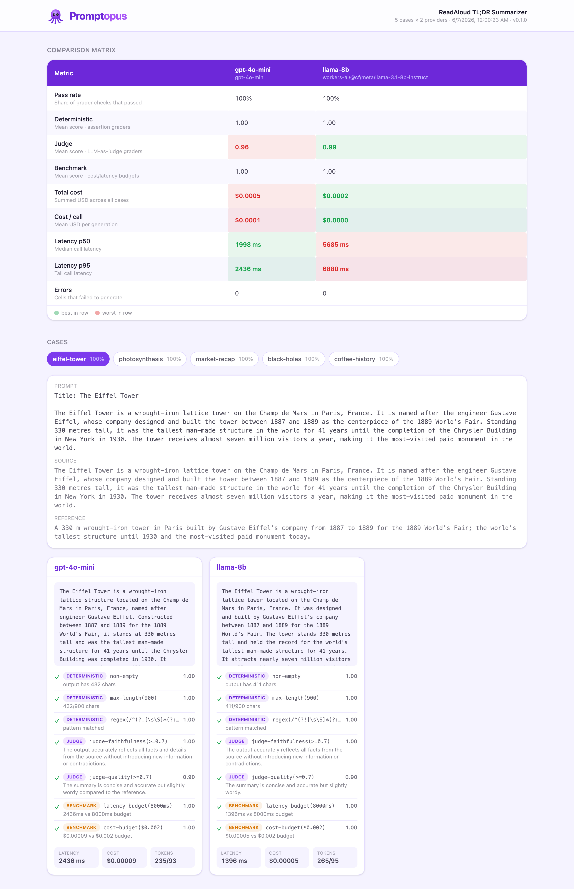
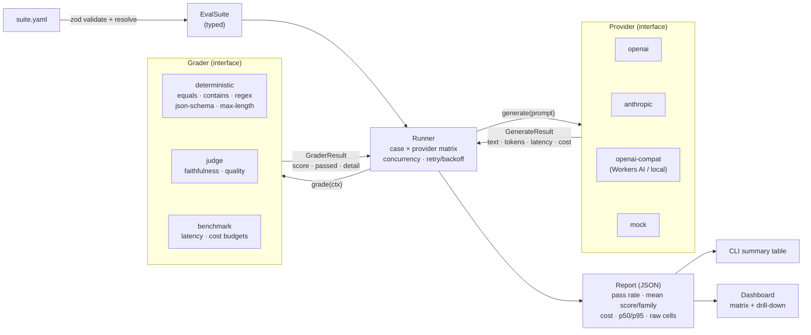

<p align="center">
  
</p>

<p align="center">
  <b>A config-driven LLM evaluation harness — CLI + dashboard.</b><br/>
  Define an eval in YAML, run it against many models, score every output with three grader
  families, and compare models side by side.
</p>

<p align="center">
  TypeScript (strict, no <code>any</code> in core) · zod-validated configs · 76 unit tests · pluggable providers &amp; graders
</p>

<p align="center">
  <a href="https://www.npmjs.com/package/promptopus"></a>
  <a href="https://github.com/gastonche/promptopus/actions/workflows/ci.yml"></a>
  <a href="LICENSE"></a>
  
  <a href="https://promptopus.pages.dev"></a>
</p>

---

## Contents

- [Why Promptopus](#why-promptopus) · [Features](#features) · [Install](#install) · [Quick start](#quick-start)
- [Architecture](#architecture) · [The three grader families](#the-three-grader-families-and-when-each-matters)
- [Dogfood: the ReadAloud benchmark](#dogfood-the-readaloud-summarizer-benchmark)
- [Adding a provider](#adding-a-provider) · [Adding a grader](#adding-a-grader) · [CLI reference](#cli-reference)
- [Known limitations](#known-limitations) · [What I'd do at scale](#what-id-do-at-scale) · [Development](#development)

## Why Promptopus

Shipping an LLM feature means answering "which model, at what cost, at what quality?" — and
re-answering it every time a model version changes. Promptopus makes that a repeatable, version-controlled
experiment: one YAML file defines your test cases, the models to compare, and how to grade them; one
command runs the matrix and writes a machine-readable report; a dashboard turns that report into a
side-by-side comparison you can actually reason about.

The two interfaces — **`Provider`** and **`Grader`** — _are_ the architecture. Adding a model vendor
or a scoring strategy means implementing one interface and registering it; nothing else changes.

## Features

- **Three grader families, one interface** — deterministic assertions, LLM-as-judge, and cost/latency
  benchmarking all implement the same `Grader`.
- **Pluggable providers** — OpenAI, Anthropic, and any OpenAI-compatible endpoint (local servers,
  Cloudflare Workers AI), plus a keyless `mock` provider for zero-cost testing.
- **Cost & latency are first-class** — tokens, computed USD, and p50/p95 latency flow into the report
  as primary metrics, not afterthoughts.
- **Resilient runs** — rate-limit-aware retry/backoff (honors `Retry-After`), concurrency control, and
  per-cell error capture: a failed case is recorded and the run continues.
- **Friendly configs** — every suite is zod-validated; invalid configs fail with precise, path-pointed
  messages, never a stack trace.
- **A real dashboard** — Vite + React + Tailwind, static (reads a JSON report), with a comparison
  matrix and per-case drill-down.

## Dashboard



## Install

```bash
npm i -g promptopus     # or run ad-hoc: npx promptopus <cmd>
```

[](https://www.npmjs.com/package/promptopus)

## Quick start

```bash
promptopus init                       # scaffold an example suite
promptopus run my.suite.yaml          # run it, write results.json, print a table
promptopus view results.json          # open the comparison dashboard
```

> The bin is `promptopus` (short alias `pop`). Provider keys are read from the environment
> (auto-loaded from `.env`); see [`.env.example`](.env.example). Run with zero keys using the built-in
> `mock` provider. Extend with your own providers/graders via a `promptopus.config.mjs` — no fork
> needed (see [Extending](#adding-a-provider)).

Developing from source instead? `npm install && npm run build`, then
`node packages/core/dist/cli/index.js …`.

A run prints a live progress view and a summary table:

```
🐙 Promptopus — ReadAloud TL;DR Summarizer
  5 cases × 2 providers, concurrency 3

  [1/10] ✓ eiffel-tower × gpt-4o-mini
  ...
Metric                 gpt-4o-mini  llama-8b
---------------------  -----------  --------
Pass rate              100%         100%
Score · judge          0.96         0.99
Cost · total           $0.0005      $0.0002
Latency · p95          2436ms       6880ms
```

## Architecture



**Data model** (`packages/core/src/domain/`):

- **`Provider`** — `{ name, model, generate(prompt, opts) → GenerateResult }`; `GenerateResult` carries
  `text`, `tokensIn/Out`, `latencyMs`, and `costUsd` (computed from a per-model pricing table).
- **`Grader`** — `grade(ctx) → { score 0–1, passed, detail }`; one interface for all three families.
- **`TestCase` / `EvalSuite`** — the resolved, runnable suite (prompts interpolated, graders merged).
- **`RunResult`** — one cell of the matrix; **`Report`** — the aggregate JSON artifact the dashboard reads.

## The three grader families (and when each matters)

| Family             | Examples                                                                                 | Cost                         | Use it when…                                                                                                                                                                                     |
| ------------------ | ---------------------------------------------------------------------------------------- | ---------------------------- | ------------------------------------------------------------------------------------------------------------------------------------------------------------------------------------------------ |
| **Deterministic**  | `equals`, `contains`, `regex`, `is-valid-json`, `json-schema`, `max-length`, `non-empty` | free, instant                | the output has a checkable contract — valid JSON, contains a required string, under a length cap, plain prose. Catch regressions that don't need a model to spot.                                |
| **LLM-as-judge**   | `judge-faithfulness`, `judge-quality`                                                    | a judge API call per check   | quality is subjective — is the summary faithful to the source? is the answer good? The judge model returns a structured, validated score; judge failures degrade gracefully to a failing result. |
| **Cost + latency** | `latency-budget`, `cost-budget`                                                          | free (uses captured metrics) | you have an SLA or a budget. These grade the metrics every call already produces, and the report aggregates p50/p95 and totals across the suite.                                                 |

Most real suites combine all three: deterministic gates for structure, judges for quality, budgets for
the economics.

## Dogfood: the ReadAloud summarizer benchmark

Promptopus benchmarks the **TL;DR summarization** feature of
[ReadAloud](https://github.com/gastonche/read-aloud) — using its _exact_ production prompt — across
**10 models** and a **12-grader battery** (simple deterministic, an LLM judge, cost/latency, and five
**custom** graders written in [`promptopus.config.mjs`](promptopus.config.mjs)).

Top of the board (sorted by pass rate; 6 cases each, judged by `gpt-4o`):

| Model                         | Pass    | Judge    | Cost (6 cases) | p95      |
| ----------------------------- | ------- | -------- | -------------- | -------- |
| **llama-3.1-8b** (Workers AI) | **99%** | **1.00** | $0.0003        | 3220 ms  |
| mistral-small-24b             | 99%     | 0.98     | $0.0008        | 4576 ms  |
| gemma-3-12b                   | 97%     | 1.00     | $0.0008        | 1665 ms  |
| gpt-4o-mini (OpenAI)          | 92%     | 1.00     | $0.0006        | 3859 ms  |
| llama-3.3-70b (largest)       | 92%     | 0.93     | $0.0021        | 4185 ms  |
| **qwq-32b** (reasoning)       | **39%** | 0.77     | $0.0033        | 15837 ms |

**Findings:** the **8B open model ReadAloud ships is the sweet spot** (99% pass, perfect
faithfulness _and_ quality, ~$0.0003) — it ties or beats the frontier `gpt-4o-mini` and every larger
model; **scaling up mostly bought verbosity** (the 70B and gpt-4o-mini lost points to the custom
`compression` grader). And the **reasoning model is the wrong tool** — `qwq-32b` leaked chain-of-thought
and cratered at 39%, caught simultaneously by length, format, `no-reasoning-leak`, `number-fidelity`,
and latency.

→ Full writeup, the 10-model table, and honest caveats: **[docs/readaloud-eval.md](docs/readaloud-eval.md)**.

## Adding a provider

Implement `Provider`, then register a factory. That's the whole contract.

```ts
// packages/core/src/providers/cohere.ts
import type { GenerateResult, Provider } from '../domain/provider.js';
import { computeCostUsd } from './pricing.js';

export class CohereProvider implements Provider {
  constructor(
    readonly name: string,
    readonly model: string,
    private apiKey: string,
  ) {}
  async generate(prompt: string): Promise<GenerateResult> {
    const start = performance.now();
    // ...call the API, read usage...
    return {
      text,
      tokensIn,
      tokensOut,
      latencyMs: Math.round(performance.now() - start),
      costUsd: computeCostUsd(this.model, tokensIn, tokensOut),
    };
  }
}
```

Then add a `kind` to the zod union in `config/schema.ts`, one `case` in `providers/registry.ts`, and a
pricing row in `providers/pricing.ts`. The runner, report, and dashboard need no changes.

## Adding a grader

Implement `Grader` (sync or async), then register it.

```ts
// packages/core/src/graders/deterministic/word-count.ts
import type { Grader } from '../../domain/grader.js';

export function wordCountGrader(spec: { max: number }): Grader {
  return {
    id: `word-count(${spec.max})`,
    family: 'deterministic',
    grade({ output }) {
      const n = output.text.trim().split(/\s+/).length;
      return {
        graderId: `word-count(${spec.max})`,
        family: 'deterministic',
        score: n <= spec.max ? 1 : 0,
        passed: n <= spec.max,
        detail: `${n}/${spec.max} words`,
      };
    },
  };
}
```

Add a variant to the `GraderSpecSchema` union and one `case` in `graders/registry.ts`. Done.

## CLI reference

| Command                          | What it does                                                   |
| -------------------------------- | -------------------------------------------------------------- |
| `promptopus init [file]`         | Scaffold an example suite (`--stdout`, `--force`).             |
| `promptopus run <suite> [opts]`  | Run the suite, write the JSON report, print the summary table. |
| `promptopus view [results.json]` | Serve the dashboard against a report (`--port`, `--no-open`).  |

`run` options: `--out <file>`, `--providers a,b` (subset), `--max-concurrency <n>`, `--retries <n>`.

## Known limitations

- **Judge cost isn't folded into per-provider cost.** Judge calls have their own cost; the report's cost
  metrics reflect the _candidate_ model only. (Judge spend is intentionally separate from candidate spend.)
- **`json-schema` grader supports a common subset** (type, required, properties, items, enum, min/max) —
  not the full JSON Schema spec. Swap in Ajv if you need it.
- **No response caching yet** — identical (prompt, model) pairs re-call the API across runs.
- **LLM-as-judge is only as good as the judge.** Saturating rubrics and self-judging bias are real; see the
  dogfood caveats. Treat judge scores as directional, not absolute.

## What I'd do at scale

- **Caching** — content-addressed cache keyed on `(provider, model, prompt, params)` so re-runs and CI are
  near-free; a `--no-cache` escape hatch.
- **Dataset versioning** — hash the suite + sources so reports are tied to an exact dataset version, and
  diffs are meaningful.
- **CI integration** — `promptopus run` with a `--fail-on` threshold (pass rate / regression delta) as a
  required check; upload the report as a build artifact.
- **Regression tracking across model versions** — store reports over time and chart pass-rate / cost /
  faithfulness as providers ship new model snapshots, so a silent quality drop is caught.
- **Judge robustness** — pairwise comparison instead of absolute scoring, multiple judges with agreement
  thresholds, and a held-out human-labeled set to calibrate the judge.

## Development

```bash
npm install
npm run build        # turbo: builds the core package then the dashboard
npm run typecheck    # strict TS across the monorepo
npm test             # vitest (core)
npm run dev --workspace @promptopus/dashboard   # dashboard dev server
```

Repo layout: `packages/core` (domain · config · providers · graders · runner · CLI), `apps/dashboard`
(Vite/React/Tailwind report viewer), `apps/web` (Astro marketing site + documentation), `suites/`
(eval definitions), `docs/` (findings + screenshot), `brand/` (logo + palette). See
**[CONTRIBUTING.md](CONTRIBUTING.md)** for setup and conventions.

```bash
npm run dev --workspace @promptopus/web   # landing page + docs (Astro)
```

## License

MIT — see [LICENSE](LICENSE).
